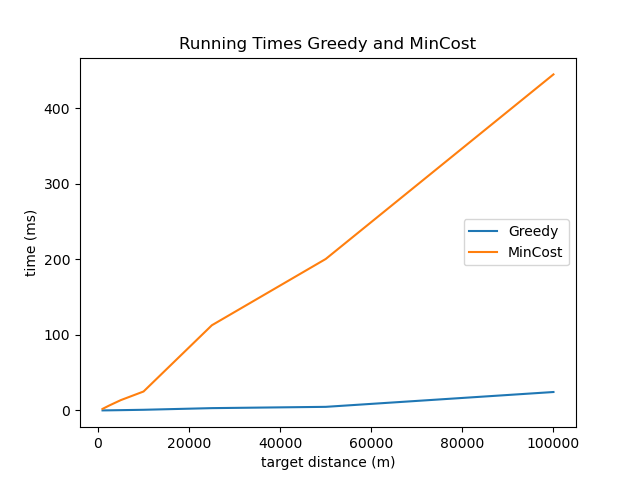

---
title: Experimental
layout: template
filename: experimental
--- 

# Technical Details

The following experiments were performed on an computer with an i7-1165G7 2.80GHz processor and 16GB of memory.

# Experiments

First we compare the running times of the Greedy and MinCost algorithm, as these algorithms finish before a set time bound. As expected the Greedy algorithm calculates an given route much faster than the MinCost algorithm.

Next we look at the improvement of ILS on a route generated by MinCost, as we can see ILS can improve an route even after a couple of seconds.

