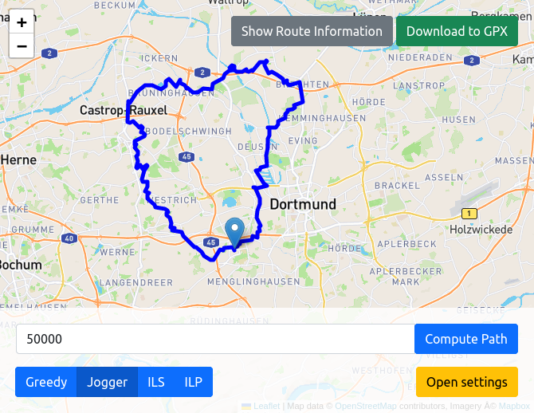

## Overview
Most people who do outdoor activities run into the problem of finding an appropriate route. 
Depending on the activity from hiking and jogging to gravel and road cycling, requirements from individual users can greatly vary.

The touring problem aims to find an ``interesting'' (round) trip of a given length. Here, what is considered interesting depends on the type of the desired route, e.g., an user may be looking for a off-road cycling trip or fast running route.
In the following, we define the touring problme formally. 
Let $$G$$ be an undirected graph consisting of a vertex set $$V$$ and a set $$E$$ of edges. Furthermore, we are given a cost function $$w{:}\ E \rightarrow \mathbb{N}$$ and a profit function $$\pi{:}\ E \rightarrow \mathbb{N}$$ assigning different cost (distance or time) and profit to each edge of $$G$$.
We can generalize the terms cost and profit to paths. 
Given a path $$P = (e_1, \cdots, e_{\ell})$$ of $$G$$, we denote the cost of $$P$$ as $$w(P)$$, which is defined as $$\sum_{i=1}^{\ell} w(e_i)$$; and for the profit of $$P$$ we write $$\pi(P) = f(P) + \sum_{ e \in \bigcup{e_i \mid 1 \leq i \leq \ell } } \pi(e)$$.
Here $$f(P)$$ can be any additional quality function based on the global structure of the path. 
In this project, we consider the area covered by $$P$$ as our additional quality measure $$f(P)$$. The idea is that an user can prefer a route resembling a circle over a long thin strip or a route with lots of intersections. The higher the covered area the closer a route resembles this circle. 

Given a cost budget $$B$$ and a starting vertex $$s$$, the objective of touring problem is to find a cycle $$P=(e_1, \cdots, e_{\ell})$$ starting and ending at the vertex $$s$$ that maximizes the profit $$\pi(P)$$ within the cost budget $$c(P) \leq B$$. 
Note that in the touring problem it is allowed to visit an edge multiple times, but its profit is only counted once.

This is the open source project **tour4me**---a touring planning solver developed at the Algorithm Engineering Chair at TU Dortmund.
Our framework includes four touring algorithms and provides an intuitive web interface to create tours following users specific demands and preferences. 
In the following demonstration we have included a new exact solver, a heuristic, and two greedy methods. The user can experiment with the algorithms and different profits/costs. The generated tours can be explored in an easy-to-use web interface.
## Framework

## Licence

This project is under MIT licence. 

## Support
Please write us an [Email](mailto:mart.hagedoorn@tu-dortmund.de) if you have questions.

We are glad to get any comments and error reports.

